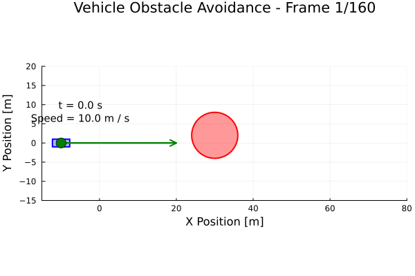

# Vehicle Obstacle Avoidance Example

This example demonstrates optimal trajectory planning for a vehicle avoiding a static circular obstacle using JuliaOptimalControl. The problem involves computing a collision-free path from start to goal while minimizing travel time and control effort using a bicycle vehicle model.

## Problem Description

The vehicle must navigate from an initial position to a target location while avoiding collision with a circular obstacle. The optimization finds the optimal trajectory that balances path efficiency, vehicle dynamics constraints, and obstacle avoidance requirements.

### System Model

The vehicle uses a 7-state bicycle model that captures essential vehicle dynamics:

**States (7):**
- `x`: X position [m]
- `y`: Y position [m]
- `v`: Lateral velocity [m/s]
- `r`: Yaw rate [rad/s]
- `ψ`: Heading angle [rad]
- `ux`: Longitudinal velocity [m/s]
- `δf`: Front steering angle [rad]

**Controls (2):**
- `ax`: Longitudinal acceleration [m/s²]
- `dδf`: Steering angle rate [rad/s]

### Vehicle Dynamics

The bicycle model captures the essential vehicle behavior:

```julia
# Position kinematics
ẋ = ux*cos(ψ) - v*sin(ψ)
ẏ = ux*sin(ψ) + v*cos(ψ)

# Lateral dynamics
v̇ = (Fyf + Fyr)/m - ux*r

# Yaw dynamics
ṙ = (lf*Fyf - lr*Fyr)/Iz

# Longitudinal dynamics
u̇x = ax

# Heading rate
ψ̇ = r

# Steering dynamics
δ̇f = dδf
```

Where front and rear tire forces `Fyf, Fyr` are computed using linear tire models based on slip angles and cornering stiffness.

## Obstacle Avoidance

The circular obstacle is avoided using a distance constraint:

```julia
# Circular obstacle constraint
(x - x_obs)² + (y - y_obs)² ≥ R²

# Where:
# x_obs = 30 m: Obstacle center X position
# y_obs = 2 m:  Obstacle center Y position
# R = 6 m:      Obstacle radius (including safety margin)
```

This constraint ensures the vehicle maintains safe separation from the obstacle at all times.

## Cost Function

The optimization objective balances multiple goals:

```julia
cost = ∫(w₁*y² + w₂*dδf² + w₃*ax² + w₄*(ux - u_ref)² + w₅*δf²)dt
```

This encourages:
- **Lane keeping**: Minimizing lateral deviation (y²)
- **Smooth steering**: Avoiding aggressive steering inputs (dδf²)
- **Smooth acceleration**: Comfortable longitudinal control (ax²)
- **Speed regulation**: Maintaining desired velocity (ux - u_ref)²
- **Minimal steering**: Reducing steering angle usage (δf²)

## Usage

Run the vehicle obstacle avoidance example:

```julia
# Navigate to the ObstacleAvoidance example directory
cd("examples/ObstacleAvoidance")

# Run the main script
include("main.jl")
```

The example will:
1. Set up the bicycle vehicle model with obstacle constraint
2. Configure the optimization problem with bounds and objectives
3. Solve the trajectory optimization
4. Generate comprehensive visualization of results

## Results

The optimal solution demonstrates intelligent collision avoidance behavior:

<div align="center">

</div>

### Animation

<div align="center">

</div>

The trajectory shows:
- **Approach phase**: Vehicle approaches obstacle while maintaining speed
- **Avoidance maneuver**: Smooth lateral motion to navigate around obstacle
- **Recovery phase**: Vehicle returns to original path after clearing obstacle

### Code Structure

```julia
# Main execution script
include("main.jl")

# Vehicle dynamics model
include("bicycleModel.jl")

# System parameters
include("parameters.jl")

# Key components:
defineOCP()                    # Set up optimization problem
ConfigurePredefined()          # Configure discretization
@constraint()                  # Add obstacle avoidance constraint
@objective()                   # Define cost function
OptSolve!()                   # Solve optimization
```

