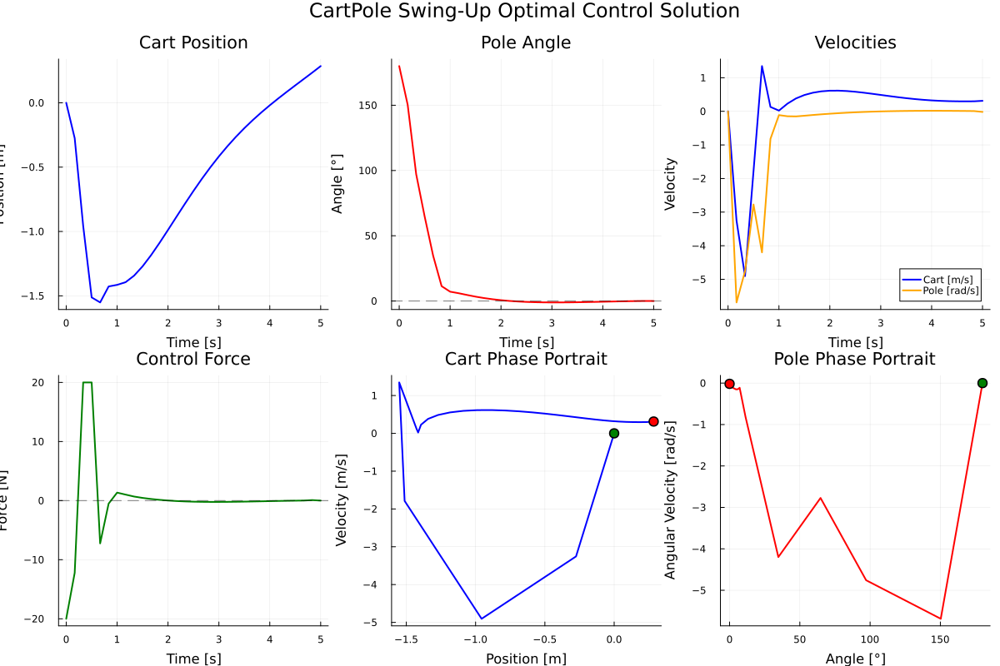

# CartPole Swing-Up Control Example

This example demonstrates optimal control of a classic cart-pole system using JuliaOptimalControl. The goal is to swing up an inverted pendulum from the hanging-down position to the upright position while keeping the cart near the center.

## Problem Description

### System Dynamics
The cart-pole system consists of:
- **Cart**: Mass M = 1.0 kg, moves horizontally on a track
- **Pole**: Mass m = 0.1 kg, length L = 0.5 m, attached to cart via pin joint
- **Control**: Horizontal force F applied to the cart

### States
- `x`: Cart position [m]
- `ẋ`: Cart velocity [m/s]
- `θ`: Pole angle from vertical [rad] (0 = upright, π = hanging down)
- `θ̇`: Pole angular velocity [rad/s]

### Control
- `F`: Horizontal force applied to cart [N], bounded to [-20, 20] N

### Objective
Swing the pole from hanging down (θ = π) to upright (θ = 0) while:
- Keeping the cart near the center (x ≈ 0)
- Minimizing control effort
- Achieving smooth motion

## Mathematical Model

The cart-pole dynamics are derived from Lagrangian mechanics:

**Cart equation:**
```
(M + m)ẍ + mL(θ̈cos(θ) - θ̇²sin(θ)) = F
```

**Pole equation:**
```
mLẍcos(θ) + mL²θ̈ = mgLsin(θ)
```

Solving these coupled equations gives:
```
ẍ = (F + mLθ̇²sin(θ) - mgsin(θ)cos(θ)) / (M + msin²(θ))
θ̈ = (-Fcos(θ) - mLθ̇²sin(θ)cos(θ) + (M+m)gsin(θ)) / (L(M + msin²(θ)))
```

## Cost Function

The cost function penalizes:
- Pole angle deviation from upright: `100 × θ²`
- Cart position deviation from center: `1 × x²`
- Velocities: `0.1 × ẋ² + 1 × θ̇²`
- Control effort: `0.01 × F²`

## Files

- `cartpole_dynamics.jl`: Contains the dynamics model and cost function
- `main.jl`: Main script to set up and solve the optimal control problem
- `README.md`: This documentation file

## Usage

```julia
# Navigate to the cartpole example directory
cd("examples/cartpole")

# Run the complete example
include("main.jl")

# Execute the optimization
ocp, frames = main()
```

## Results

The optimal solution demonstrates the classic swing-up strategy:



The trajectory shows:
1. **Initial phase**: Apply force to build up energy and create pendulum motion
2. **Swing phase**: Coordinate cart and pole motion to transfer energy efficiently
3. **Balancing phase**: Fine control to stabilize at the upright position

### Code Structure

```julia
# Main execution script
include("main.jl")

# System dynamics and cost functions
include("cartpole_dynamics.jl")

# Key functions:
setup_cartpole_problem()     # Define states, controls, bounds
configure_solver()           # Set up discretization and integration
solve_cartpole()            # Solve the optimization problem
visualize_results()         # Create comprehensive plots
create_animation_frames()   # Generate animation frames
main()                      # Execute complete example
```

### Visualizations

The example generates several plots saved to `figures/`:
- **State trajectories**: Cart position and pole angle over time
- **Control input**: Applied force over time
- **Phase portraits**: State space trajectories
- **Animation frames**: For creating motion visualizations

### Key Insights

1. **Energy-based strategy**: The controller first builds up energy in the system through oscillatory motion
2. **Precise timing**: Critical coordination between cart acceleration and pole dynamics
3. **Nonlinear control**: Linear control strategies fail for this large-angle problem
4. **Stabilization**: Near the upright position, the controller switches to fine stabilization

## Physical Interpretation

This problem represents a fundamental challenge in underactuated robotics where:
- We have fewer control inputs (1) than degrees of freedom (2)
- The system has unstable equilibria (upright position)
- Large angular motions require nonlinear control strategies

Applications include:
- Inverted pendulum control
- Humanoid robot balancing
- Rocket landing control
- Walking robots

## Numerical Properties

- **Time horizon**: 3.0 seconds
- **Discretization**: 51 time points
- **Integration**: 4th-order Runge-Kutta (RK4)
- **Solver**: Ipopt with automatic differentiation
- **Typical solve time**: < 1 second

## Extensions

Try modifying the example:
1. Change initial conditions (different starting angles)
2. Adjust cost function weights
3. Add state constraints (track boundaries)
4. Include actuator dynamics
5. Add disturbances or noise
6. Multiple swing-ups in sequence

## References

1. Fantoni, I., & Lozano, R. (2002). *Non-linear control for underactuated mechanical systems*. Springer.
2. Åström, K. J., & Furuta, K. (2000). Swinging up a pendulum by energy control. *Automatica*, 36(2), 287-295.
3. Betts, J. T. (2010). *Practical methods for optimal control and estimation using nonlinear programming*. SIAM.