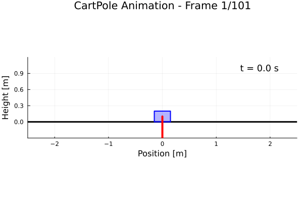

# CartPole Swing-Up Control Example

This example demonstrates optimal control of a classic cart-pole system using JuliaOptimalControl. The goal is to swing up an inverted pendulum from the hanging-down position to the upright position while keeping the cart near the center.

## Problem Description

### System Dynamics
The cart-pole system consists of:
- **Cart**: Mass M = 1.0 kg, moves horizontally on a track
- **Pole**: Mass m = 0.1 kg, length L = 0.5 m, attached to cart via pin joint
- **Control**: Horizontal force F applied to the cart

### States
- `x`: Cart position [m]
- `ẋ`: Cart velocity [m/s]
- `θ`: Pole angle from vertical [rad] (0 = upright, π = hanging down)
- `θ̇`: Pole angular velocity [rad/s]

### Control
- `F`: Horizontal force applied to cart [N], bounded to [-20, 20] N

### Objective
Swing the pole from hanging down (θ = π) to upright (θ = 0) while:
- Keeping the cart near the center (x ≈ 0)
- Minimizing control effort
- Achieving smooth motion

## Mathematical Model

The cart-pole dynamics are derived from Lagrangian mechanics:

**Cart equation:**
```
(M + m)ẍ + mL(θ̈cos(θ) - θ̇²sin(θ)) = F
```

**Pole equation:**
```
mLẍcos(θ) + mL²θ̈ = mgLsin(θ)
```

Solving these coupled equations gives:
```
ẍ = (F + mLθ̇²sin(θ) - mgsin(θ)cos(θ)) / (M + msin²(θ))
θ̈ = (-Fcos(θ) - mLθ̇²sin(θ)cos(θ) + (M+m)gsin(θ)) / (L(M + msin²(θ)))
```

## Cost Function

The cost function penalizes:
- Pole angle deviation from upright: `100 × θ²`
- Cart position deviation from center: `1 × x²`
- Velocities: `0.1 × ẋ² + 1 × θ̇²`
- Control effort: `0.01 × F²`

## Files

- `cartpole_dynamics.jl`: Contains the dynamics model and cost function
- `main.jl`: Main script to set up and solve the optimal control problem
- `README.md`: This documentation file

## Usage

```julia
# Navigate to the cartpole example directory
cd("examples/cartpole")

# Run the complete example
include("main.jl")

# Execute the optimization
ocp, frames = main()
```

## Results

The optimal solution demonstrates the classic swing-up strategy:

<div align="center">

</div>

### Animation

<div align="center">

</div>

The trajectory shows:
1. **Initial phase**: Apply force to build up energy and create pendulum motion
2. **Swing phase**: Coordinate cart and pole motion to transfer energy efficiently
3. **Balancing phase**: Fine control to stabilize at the upright position

---

## Implementation Steps

#### 1. Problem Setup
Define the cart-pole system with 4 states and 1 control input:

```julia
# Cart-pole system: 4 states, 1 control
ocp = defineOCP(
    numStates = 4,
    numControls = 1,
    X0 = [0.0, 0.0, π, 0.0],        # [x, ẋ, θ, θ̇] - start hanging down
    XF = [NaN, NaN, 0.0, NaN],      # Final angle must be upright (θ = 0)
    XL = [-3.0, -10.0, -2π, -10.0], # State lower bounds
    XU = [3.0, 10.0, 2π, 10.0],     # State upper bounds
    CL = [-20.0],                    # Force lower bound
    CU = [20.0]                      # Force upper bound
)

# Assign meaningful names to variables
defineStates!(ocp, [:x, :ẋ, :θ, :θ̇])
defineControls!(ocp, [:F])
```

#### 2. Dynamics
Implement the cart-pole dynamics derived from Lagrangian mechanics:

```julia
function cartpole_dynamics(states, controls, parameters)
    x, ẋ, θ, θ̇ = states    # Extract state variables
    F = controls[1]        # Applied horizontal force

    # Physical parameters
    M = 1.0    # Cart mass [kg]
    m = 0.1    # Pole mass [kg]
    L = 0.5    # Pole half-length [m]
    g = 9.81   # Gravity [m/s²]

    # Compute accelerations from coupled equations
    sin_θ = sin(θ)
    cos_θ = cos(θ)
    denominator = M + m*sin_θ^2

    # Cart acceleration: ẍ
    ẍ = (F + m*L*θ̇^2*sin_θ - m*g*sin_θ*cos_θ) / denominator

    # Pole angular acceleration: θ̈
    θ̈ = (-F*cos_θ - m*L*θ̇^2*sin_θ*cos_θ + (M+m)*g*sin_θ) / (L*denominator)

    return [ẋ, ẍ, θ̇, θ̈]  # State derivatives
end
```

#### 3. Configuration
Set up the discretization and integration scheme:

```julia
formulation = ConfigurePredefined(ocp,
    Np = 51,                        # 51 discretization points
    tf = 3.0,                       # 3 second time horizon
    IntegrationScheme = :RK4,       # 4th-order Runge-Kutta
    dx = cartpole_dynamics,         # System dynamics
    expr = cartpole_cost            # Cost function
)
```

#### 4. Constraints
Build the optimization problem (no additional path constraints needed):

```julia
# Build the optimization problem with dynamics constraints
OCPdef!(ocp, formulation)

# The cart-pole problem only requires the dynamics constraints
# and boundary conditions (already specified in defineOCP)
```

#### 5. Objectives
Define the cost function to encourage swing-up with minimal effort:

```julia
function cartpole_cost(states, controls, parameters)
    x, ẋ, θ, θ̇ = states
    F = controls[1]

    # Penalize deviations from target state (upright at center)
    return 100*θ^2 +      # Pole angle deviation (heaviest weight)
           1*x^2 +        # Cart position deviation
           0.1*ẋ^2 +      # Cart velocity
           1*θ̇^2 +        # Pole angular velocity
           0.01*F^2       # Control effort (lightest weight)
end

# Set up the objective
cost_integral = ExprIntegral(ocp)
@objective(ocp.f.mdl, Min, cost_integral)
```

**Mathematical formulation:**
```
J = ∫₀ᵗᶠ [100θ² + x² + 0.1ẋ² + θ̇² + 0.01F²] dt
```

This cost function balances multiple objectives:
- `100θ²`: Heavy penalty on pole angle deviation (primary goal: reach upright position)
- `x²`: Keep cart near center position
- `0.1ẋ²`: Smooth cart motion
- `θ̇²`: Minimize pole angular velocity for stability
- `0.01F²`: Minimize control effort

#### 6. Solution
Solve the optimal control problem:

```julia
# Solve the optimization problem
@time OptSolve!(ocp)

# Check solution status
println("Solution status: ", ocp.r.Status)
println("Objective value: ", ocp.r.Objval)
println("Solve time: ", ocp.r.TSolve, " seconds")
println("Solver iterations: ", ocp.r.IterNum)
```

#### 7. Visualization
Generate plots to analyze the swing-up strategy:

```julia
using Plots

# Plot state trajectories
states_plot = plot(layout=(2,2), size=(800,600))

plot!(ocp.r.Tst, ocp.r.X[:, 1], subplot=1,
      label="Cart Position", xlabel="Time [s]", ylabel="x [m]", linewidth=2)

plot!(ocp.r.Tst, ocp.r.X[:, 2], subplot=2,
      label="Cart Velocity", xlabel="Time [s]", ylabel="ẋ [m/s]", linewidth=2)

plot!(ocp.r.Tst, ocp.r.X[:, 3], subplot=3,
      label="Pole Angle", xlabel="Time [s]", ylabel="θ [rad]", linewidth=2)

plot!(ocp.r.Tst, ocp.r.X[:, 4], subplot=4,
      label="Pole Angular Velocity", xlabel="Time [s]", ylabel="θ̇ [rad/s]", linewidth=2)

# Plot control input
control_plot = plot(ocp.r.Tst, ocp.r.U[:, 1],
                   label="Applied Force", xlabel="Time [s]", ylabel="F [N]",
                   title="Control Input", linewidth=2)

# Convert results to DataFrame for further analysis
results_df = ResultsToDataFrame(ocp)
```

---
