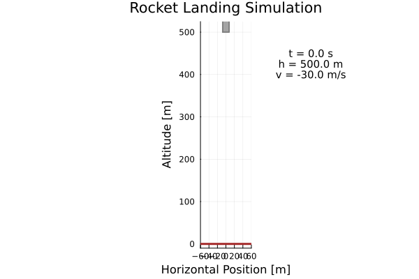

# Rocket Landing Optimal Control Example

This example demonstrates optimal control of a rocket performing a vertical landing maneuver, inspired by SpaceX Falcon 9 landings. The goal is to land the rocket softly on the ground while minimizing fuel consumption.

## Problem Description

### System Dynamics
The rocket system consists of:
- **Rocket Body**: Variable mass due to fuel consumption
- **Propulsion**: Single engine providing vertical thrust
- **Environment**: Constant gravitational field

### States
- `h`: Altitude above ground [m]
- `v`: Vertical velocity [m/s] (positive = upward, negative = downward)
- `m`: Total mass [kg] (decreases as fuel burns)

### Control
- `T`: Thrust force [N], bounded to [0, 25000] N

### Objective
Land the rocket safely while minimizing fuel consumption:
- Start from high altitude with downward velocity
- End at ground level with soft landing velocity
- Minimize thrust usage (proportional to fuel consumption)

## Mathematical Model

The rocket dynamics in vertical flight are:

**Altitude equation:**
```
ḣ = v
```

**Velocity equation (Newton's second law):**
```
mv̇ = T - mg
v̇ = T/m - g
```

**Mass equation (rocket equation):**
```
ṁ = -T/ve
```

Where:
- `g = 9.81 m/s²`: gravitational acceleration
- `ve = 2500 m/s`: effective exhaust velocity (typical for LOX/RP-1)

## Cost Function

The optimization minimizes:
- **Primary objective**: Fuel consumption (∝ thrust integral)
- **Terminal cost**: Landing accuracy
  - Altitude deviation from ground: `1000 × h_final²`
  - Velocity deviation from soft landing: `100 × (v_final + 1)²`

## Physical Parameters

- **Dry mass**: 1000 kg (empty rocket structure)
- **Initial fuel**: 500 kg
- **Maximum thrust**: 25,000 N (thrust-to-weight ratio ≈ 1.7)
- **Exhaust velocity**: 2500 m/s (specific impulse ≈ 255 s)

## Constraints

### State Constraints
- `h ≥ 0`: No ground penetration
- `m ≥ dry_mass`: Can't burn rocket structure
- Velocity and altitude bounds for numerical stability

### Path Constraints
- `T ≥ 0`: No negative thrust (engine can't suck exhaust)
- `T ≤ T_max`: Thrust limit
- Monotonic mass decrease: `ṁ ≤ 0`

### Terminal Constraints
- `h_final = 0`: Land on ground
- `-5 ≤ v_final ≤ 0`: Soft landing velocity range

## Files

- `rocket_dynamics.jl`: Contains the dynamics model and cost functions
- `main.jl`: Main script to set up and solve the optimal control problem
- `README.md`: This documentation file

## Usage

Run the rocket landing optimization example:

```julia
# Navigate to the rocket landing example directory
cd("examples/rocket_landing")

# Run the complete example
include("main.jl")

# Execute the optimization
ocp, frames = main()
```

## Results

The optimal solution demonstrates the classic rocket landing strategy:

<div align="center">

</div>

### Animation

<div align="center">

</div>

The trajectory shows:
1. **Initial Phase**: High thrust to decelerate rapidly
2. **Coasting Phase**: Minimal thrust to conserve fuel
3. **Final Approach**: Precise thrust control for soft landing

---

## Implementation Steps

---

#### 1. Problem Setup

Define the rocket landing system with 3 states and 1 control input:

**State vector:** `x = [h, v, m]ᵀ` where:
- `h`: Altitude above ground [m]
- `v`: Vertical velocity [m/s] (positive = upward, negative = downward)
- `m`: Total rocket mass [kg] (decreases due to fuel consumption)

**Control input:** `u = T` (thrust force [N])

```julia
# Rocket landing system: 3 states, 1 control
ocp = defineOCP(
    numStates = 3,
    numControls = 1,
    X0 = [1000.0, -50.0, 1500.0],    # [h, v, m] - start high with downward velocity
    XF = [0.0, NaN, NaN],            # Final altitude must be ground level
    XL = [0.0, -100.0, 1000.0],      # State lower bounds
    XU = [1200.0, 20.0, 1500.0],     # State upper bounds
    CL = [0.0],                      # Thrust lower bound (no negative thrust)
    CU = [25000.0]                   # Maximum thrust bound
)

# Assign meaningful names to variables
defineStates!(ocp, [:h, :v, :m])
defineControls!(ocp, [:T])
```

---

#### 2. Dynamics

Implement the rocket dynamics based on Newton's laws and the rocket equation:

**Equations of motion:**
```
ḣ = v                    (kinematic equation)
v̇ = T/m - g             (Newton's second law)
ṁ = -T/vₑ               (rocket equation)
```

Where:
- `g = 9.81 m/s²`: gravitational acceleration
- `vₑ = 2500 m/s`: effective exhaust velocity

```julia
function rocket_dynamics(states, controls, parameters)
    h, v, m = states       # Extract state variables
    T = controls[1]        # Thrust force

    # Physical constants
    g = 9.81              # Gravitational acceleration [m/s²]
    ve = 2500.0           # Effective exhaust velocity [m/s]

    # State derivatives from rocket dynamics
    dh = v                           # Altitude rate = velocity
    dv = T/m - g                     # Acceleration from thrust and gravity
    dm = -T/ve                       # Mass rate from fuel consumption

    return [dh, dv, dm]   # State derivatives
end
```

---

#### 3. Configuration

Set up the discretization and integration scheme for the landing trajectory:

**Discretization:** Convert continuous-time problem to discrete nonlinear program
**Time horizon:** T = 25.0 seconds (landing time)
**Grid points:** N = 41 points
**Integration:** 4th-order Runge-Kutta (RK4)

```julia
formulation = ConfigurePredefined(ocp,
    Np = 41,                        # 41 discretization points
    tf = 25.0,                      # 25 second landing time
    IntegrationScheme = :RK4,       # 4th-order Runge-Kutta
    dx = rocket_dynamics,           # System dynamics
    expr = rocket_cost              # Cost function
)
```

---

#### 4. Constraints

Build the optimization problem with landing constraints:

**Dynamics constraints:** `ẋ = f(x, u)` enforced at each discretization point
**Landing constraints:**
- Final altitude: `h(T) = 0` (land on ground)
- Soft landing: `-5 ≤ v(T) ≤ 0` (controlled touchdown velocity)
- Mass conservation: `m(t) ≥ m_dry` (don't burn structure)

```julia
# Build the optimization problem with dynamics constraints
OCPdef!(ocp, formulation)

# Add soft landing velocity constraint
v_final = ocp.p.x[end, 2]  # Final velocity
@constraint(ocp.f.mdl, v_final >= -5.0)    # Not too fast downward
@constraint(ocp.f.mdl, v_final <= 0.0)     # Must be downward

# Mass constraint (don't burn below dry mass)
m_dry = 1000.0  # Dry mass [kg]
for i in 1:ocp.s.states.pts
    @constraint(ocp.f.mdl, ocp.p.x[i, 3] >= m_dry)
end
```

---

#### 5. Objectives

Define the cost function to minimize fuel consumption while ensuring safe landing:

**Cost functional:**
```
J = ∫₀ᵀ T dt + 1000h(T)² + 100(v(T) + 1)²
```

**Objective components:**
- `∫ T dt`: Minimize total fuel consumption (thrust integral)
- `1000h(T)²`: Heavy penalty for altitude error at landing
- `100(v(T) + 1)²`: Penalty for deviation from ideal landing velocity (-1 m/s)

```julia
function rocket_cost(states, controls, parameters)
    h, v, m = states
    T = controls[1]

    # Running cost: fuel consumption proportional to thrust
    return T  # Minimize thrust usage (∝ fuel consumption)
end

# Set up the objective with terminal costs
cost_integral = ExprIntegral(ocp)
h_final = ocp.p.x[end, 1]     # Final altitude
v_final = ocp.p.x[end, 2]     # Final velocity

@objective(ocp.f.mdl, Min,
    cost_integral +                    # Fuel consumption
    1000*h_final^2 +                  # Landing accuracy
    100*(v_final + 1.0)^2             # Soft landing penalty
)
```

---

#### 6. Solution

Solve the fuel-optimal landing problem:

**Solver:** Ipopt (Interior Point Optimizer)
**Variables:** ~125 (41 × 3 states + 41 × 1 controls + slack variables)
**Constraints:** ~120 (dynamics + landing constraints)

```julia
# Solve the optimization problem
@time OptSolve!(ocp)

# Check solution status
println("Solution status: ", ocp.r.Status)
println("Objective value: ", ocp.r.Objval, " (fuel units)")
println("Solve time: ", ocp.r.TSolve, " seconds")
println("Landing time: ", ocp.r.Tst[end], " seconds")

# Extract landing metrics
final_altitude = ocp.r.X[end, 1]
final_velocity = ocp.r.X[end, 2]
fuel_used = ocp.r.X[1, 3] - ocp.r.X[end, 3]

println("Final altitude: ", final_altitude, " m")
println("Final velocity: ", final_velocity, " m/s")
println("Fuel consumed: ", fuel_used, " kg")
```

---

#### 7. Visualization

Generate plots to analyze the optimal landing strategy:

**Analysis plots:**
- Trajectory: `h(t), v(t), m(t)` vs time
- Control: `T(t)` and thrust-to-weight ratio
- Phase portraits: `(h, v)` trajectory in state space

```julia
using Plots

# Plot rocket states
states_plot = plot(layout=(2,2), size=(800,600))

plot!(ocp.r.Tst, ocp.r.X[:, 1], subplot=1,
      label="Altitude", xlabel="Time [s]", ylabel="h [m]", linewidth=2)

plot!(ocp.r.Tst, ocp.r.X[:, 2], subplot=2,
      label="Velocity", xlabel="Time [s]", ylabel="v [m/s]", linewidth=2)

plot!(ocp.r.Tst, ocp.r.X[:, 3], subplot=3,
      label="Mass", xlabel="Time [s]", ylabel="m [kg]", linewidth=2)

# Thrust profile
plot!(ocp.r.Tst, ocp.r.U[:, 1], subplot=4,
      label="Thrust", xlabel="Time [s]", ylabel="T [N]", linewidth=2)

# Thrust-to-weight ratio
g = 9.81
thrust_to_weight = ocp.r.U[:, 1] ./ (ocp.r.X[:, 3] * g)
plot(ocp.r.Tst, thrust_to_weight,
     label="Thrust-to-Weight", xlabel="Time [s]", ylabel="T/W [-]",
     title="Thrust-to-Weight Ratio", linewidth=2)

# Phase portrait (altitude vs velocity)
plot(ocp.r.X[:, 1], ocp.r.X[:, 2],
     label="Landing Trajectory", xlabel="Altitude [m]", ylabel="Velocity [m/s]",
     title="Phase Portrait", linewidth=2, marker=:circle, markersize=2)

# Convert results to DataFrame for further analysis
results_df = ResultsToDataFrame(ocp)
```

---